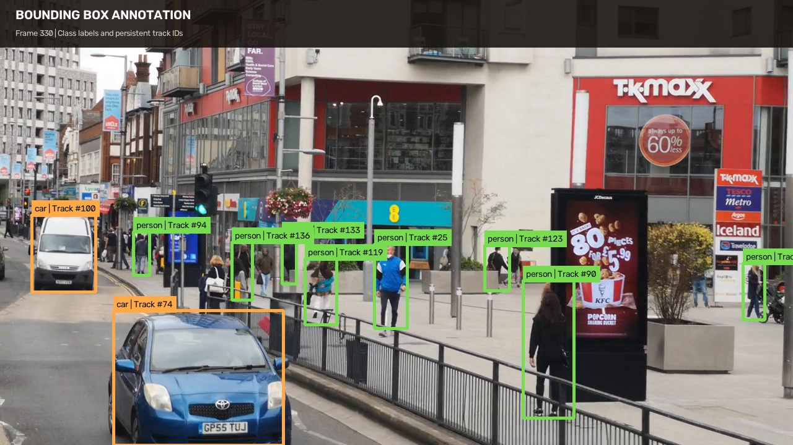
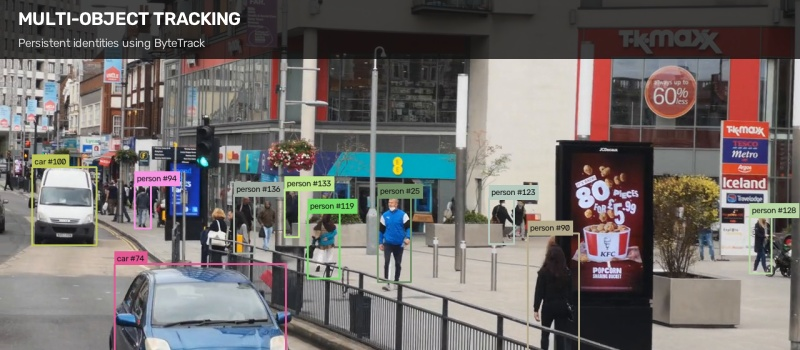
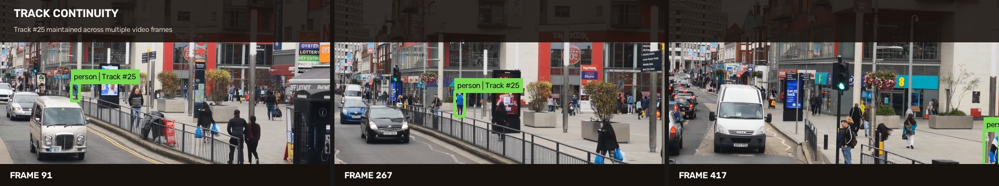
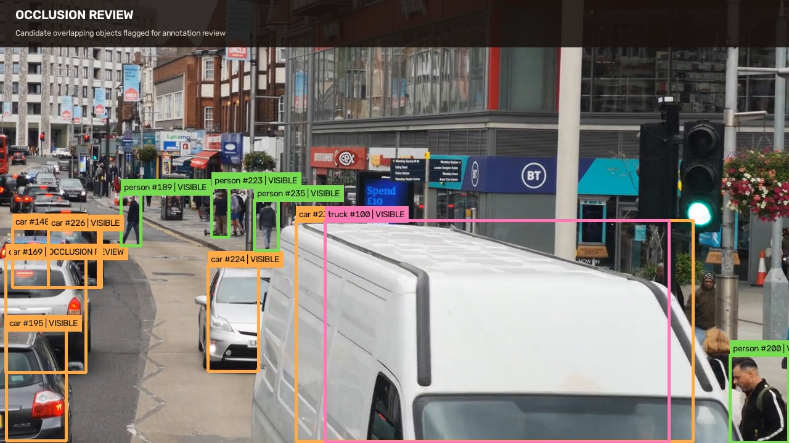
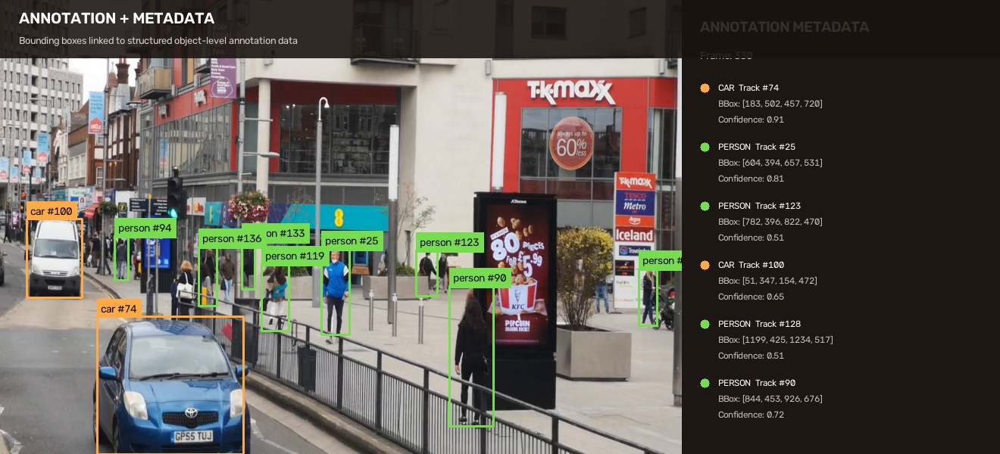
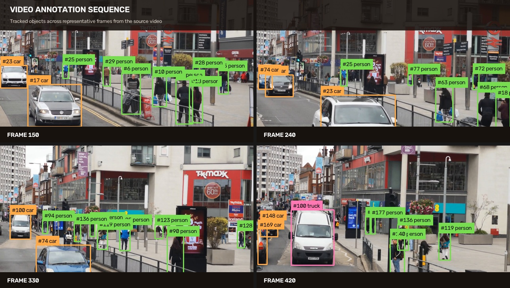
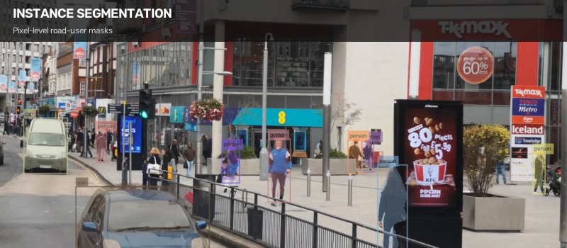

# Video Annotation

A practical video annotation project demonstrating frame-level object labeling, bounding boxes, persistent track IDs, track continuity, occlusion review, annotation metadata, and quality control for computer vision datasets.

The project uses a real-world traffic sequence to demonstrate how objects can be identified and tracked consistently across video frames while maintaining structured annotation information.

---

## Project Overview

High-quality video annotation requires more than placing bounding boxes around visible objects. Labels must remain consistent across frames, object identities must be preserved, temporary occlusions need review, and annotation errors must be identified before the data is used downstream.

This project demonstrates a complete video annotation workflow covering:

- Bounding-box annotation
- Frame-level object labeling
- Persistent object and track IDs
- Multi-object tracking
- Track continuity
- Occlusion review
- Object trajectory visualization
- Annotation metadata
- Annotation quality control
- Instance segmentation
- Frame sequence analysis

---

## Video Annotation Workflow


*Annotation and tracking visualization generated for this project. Source footage by [George Morina on Pexels](https://www.pexels.com/video/people-walking-and-moving-cars-on-the-road-5222540/).*

The workflow demonstrates four complementary views of the same video sequence:

**Object Detection** — identifies relevant objects within individual video frames.

**Multi-Object Tracking** — maintains persistent identities as objects move through the scene.

**Trajectory Analysis** — visualizes recent movement histories for tracked objects.

**Instance Segmentation** — represents object boundaries at pixel level.

---

## Bounding Box Annotation



Objects are represented using bounding boxes with class labels and persistent track identifiers.

The annotation structure supports road-user categories such as:

- Person
- Bicycle
- Car
- Motorcycle
- Bus
- Truck

Each tracked object maintains an identity that can be followed across consecutive frames.

---

## Object Tracking



Persistent track IDs associate the same object across multiple video frames.

Maintaining stable identities is important for video datasets because an object may change position, scale, visibility, or appearance as the sequence progresses.

---

## Track Continuity



This example shows the same tracked object at different points in the video.

Track continuity helps verify that:

- The same object retains its identity
- IDs are not unnecessarily switched
- Tracks remain consistent between frames
- Objects are correctly followed through movement
- Reappearing objects can be reviewed for identity consistency

---

## Trajectory Analysis


Recent object positions are retained to visualize movement through the scene.

Short trajectory histories make it easier to inspect object movement without allowing long tracks to obscure the underlying video frame.

---

## Occlusion Review



Crowded video scenes can contain overlapping or partially hidden objects.

Potential overlap cases are surfaced for review so an annotator can determine whether an object's visibility or annotation requires adjustment.

This visualization represents an **occlusion review workflow** rather than treating overlap alone as confirmed occlusion.

---

## Annotation Metadata



Visual annotations can be associated with structured metadata such as:

- Frame number
- Object class
- Track ID
- Bounding-box coordinates
- Detection confidence
- Visibility or review state

Connecting visual labels with structured metadata makes annotations easier to inspect, validate, convert, and use in downstream datasets.

---

## Annotation Quality Control


Annotation QA checks help identify labels that may require manual review.

Example validation checks include:

- Invalid bounding-box dimensions
- Out-of-frame coordinates
- Extremely small annotations
- Missing labels
- Track inconsistencies
- Duplicate annotations
- Broken track continuity
- Unexpected object classes

The objective is to identify questionable annotations before dataset delivery or model training.

---

## Frame-Level Annotation



Representative frames demonstrate how labeled objects change position throughout the video while retaining their identities.

This type of sequence review is useful for detecting:

- Track ID switches
- Missing annotations
- Incorrect labels
- Inconsistent bounding boxes
- Entry and exit errors
- Track continuity problems

---

## Instance Segmentation



Instance segmentation provides more precise object boundaries than rectangular bounding boxes.

This can support datasets where pixel-level object localization is required.

---

## Annotation Pipeline

```text
Video Input
    │
    ▼
Frame Extraction
    │
    ▼
Object Identification
    │
    ▼
Bounding Box Annotation
    │
    ▼
Track ID Assignment
    │
    ▼
Frame-to-Frame Tracking
    │
    ├── Track Continuity
    ├── Occlusion Review
    └── Trajectory Analysis
    │
    ▼
Annotation Validation
    │
    ▼
Quality-Control Review
    │
    ▼
Dataset / Annotation Export

## Video Source & Attribution

The source video used for the annotation examples in this project is:

**People Walking and Moving Cars on the Road**  
Video by **George Morina** on **Pexels**

- Source: [View original video on Pexels](https://www.pexels.com/video/people-walking-and-moving-cars-on-the-road-5222540/)
- License: [Pexels License](https://www.pexels.com/license/)

The original footage was used as source material for this computer vision and video annotation demonstration. Generated bounding boxes, tracking IDs, trajectories, segmentation masks, annotation metadata, and QA visualizations are project outputs and are not part of the original Pexels video.
